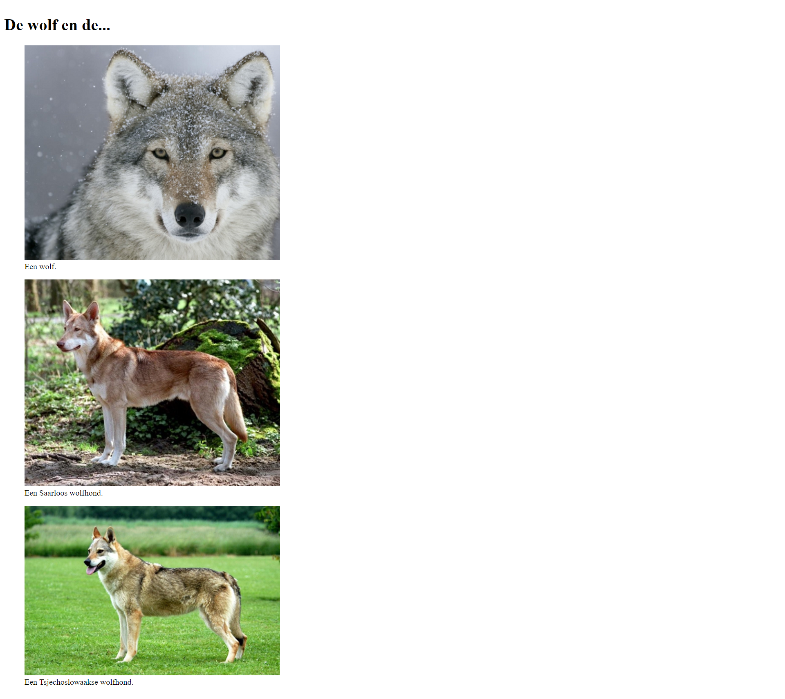

# Oefeningen les 2: HTML basis deel 2

## Oefening 1: DOM-tree, HTML validation

### Opdracht 1 - DOM-tree
Open de pagina **opdracht1.html** in de map **oefening01** in de browser en open de **Developer Tools**
- bekijk de **DOM-tree** van deze pagina in de **Elements**-tab van de developer tools
  - klap alles toe zodat je duidelijk ziet wat het **HTML**-element bevat: 

  - we kunnen deze **boomstructuur** horizontaal als volgt voorstellen op een blad papier 

  - begin nu af te dalen in **DOM-tree** (i.e. openklappen) en probeer de DOM-tree voor deze pagina volledig te visualiseren op papier
  - ook deze oefening kan je herhalen voor andere pagina's of delen van pagina's; kennis van de **DOM** zal onontbeerlijk zijn bij Web Development!
- EXTRA: zoek op het internet een **DOM** visualizer tool en gebruik die om een mooie voorstelling van de boom te bekomen
  

### Opdracht 2 - HTML Validation
De pagina **opdracht02.html** in map **oefening01** werd niet goed opgesteld, ze bevat verschillende errors. 
- probeer alle errors weg te werken
- valideer je pagina op https://validator.w3.org/ en werk eventueel overgebleven errors weg
- maak van https://validator.w3.org/nu/ een bookmark in je browser; vanaf nu ga je **altijd je werk controleren mbv de validator** 
   

---
## Oefening 2 - List - Hyperlinks

### Opdracht 1

Maak in de map **oefening02** een nieuw bestand **opdracht01.html**. Volg onderstaande stappen om tot het getoonde resultaat te komen
- maak gebruik van **Emmet** om het skelet van de pagina te creëren
- pas in het **head**-element de titel en taal aan
- pas de **body** aan
- geef via **tekstmarkering** aan dat de hoofdstad van elke provincie **belangrijk** is.

  
  

### Opdracht 2

Open het bestand **opdracht02.html** (in Visual Studio Code) en maak de gevraagde lijst (zie HTML-commentaar).
  

### Opdracht 3

Open het bestand **opdracht03.html** en zorg dat je onderstaand resultaat bekomt.
- maak gebruik van een description list
- geef aan dat de termen HTML en CSS afkortingen zijn

  
  

### Opdracht 4

Open het bestand **opdracht04.html** en volg de instructies. Zorg dat je onderstaand resultaat bekomt.
- vul de afkortingen voor de verschillende gassen aan
- gebruik **Named Character References** voor de **speciale tekens** Euro, Yen, Pound en Dollar

  
  

### Opdracht 5
Open de pagina **opdracht05.html**. Op de pagina vind je in de main enkele article elementen.
- voeg aan elk **article**-element een **attribuut id** toe en geef het id een waarde
  - tip: gebruik bv. een korte schrijfwijze van de opleiding
  - tip: maak gebruik van de mogelijkheid die VS Code biedt om blokken toe te klappen, zo kan je het overzicht goed bewaren
- voeg net voor de sluittag van het **header**-element een **nav**-element toe
- maak nu adhv **a**-elementen bladwijzers zodat je via een klik op de bladwijzer direct op de betreffende opleiding komt
- test of de bladwijzers werken
  - tip: maak je venster klein zodat je effectief het effect van de bladwijzers ziet
- voeg onder het main-element een alinea toe met de tekst "terug naar boven"
- pas de pagina aan zodat wanneer de gebruiker klikt op "terug naar boven" deze automatisch terug helemaal bovenaan de pagina komt
  <!-- - tip: voeg aan een gepast element het id attribuut toe en maak via een a-element een bladwijzer -->
  - test of de bladwijzer werkt
- voor het aanduiden van contactinformatie bevat HTML5 een specicfiek element. In de footer is dit element echter niet gebruikt. Pas dit aan. 
- zorg dat de gebruiker eenvoudig kan bellen door op het telefoonnummer, dat in de footer staat, te klikken; maak hiervoor een hyperlink waarbij je in het href attribuut gebruik maakt van **tel:**
- voeg onder het telefoonnummer nog een e-mail adres (info@hogent.be) toe; zorg dat bij een klik op het e-mail adres het e-mail programma van de gebruiker geopend wordt en een mail klaarstaat geaddresseerd aan info@hogent.be
  

---
## Oefening 3: Paginastructuur

Bekijk onderstaande afbeelding (site https://www.vrt.be/vrtnws/nl/)
- welke onderdelen herken je op de pagina? Denk aan titel, header, footer, main, nav, section/article, ...
- herhaal deze oefening voor enkele andere pagina's die je zelf kiest
- maak er vanaf nu een gewoonte van om deze zaken te zoeken/herkennen als je op het internet surft

  

---
## Oefening 4: Hyperlinks en afbeeldingen

Open in de map **oefening04-hyperlinks-afbeeldingen** de pagina **index.html**. De pagina bevat een thumbnail afbeelding. Pas de pagina als volgt aan
- wanneer op de thumbnail geklikt wordt dan opent de grote foto _elephants.png_ in een apart venster
- wanneer op 'download picture' wordt geklikt dan wordt de grote foto gedownload
- stel de icon _favicon.ico_ uit de map images in als **favicon**
  

---
## Oefening 5: Afbeeldingen - wolven

- Maak de map **oefening05-afbeeldingen-wolven** aan en voeg een pagina **index.html** en een submap genaamd **images** toe. 
- Zoek een afbeelding van een tsjechoslowaakse wolfhond, een saarloos wolfhond en een wolf. 
- Schaal elke afbeelding naar een breedte van 500px. *Je kan dit online doen of via een eenvoudig tekenprogramma zoals MS Paint*
- Bewaar deze afbeeldingen in de map **images** en bouw je pagina op volgens onderstaande screenshot.

 

---

## Oefening 6: Schilderwerken Vander Beken

Deze oefening is een website met meerdere pagina's.

Denk eraan: valideer steeds je code op [https://validator.w3.org](https://validator.w3.org)

Maak deze oefening in de map **oefening06-vanderBeken**. Merk op dat deze map reeds is aangemaakt en reeds alle afbeeldingen bevat die in de oefening worden gebruikt.

**Maak je folder structuur als volgt aan.**

1. Maak de volgende submappen aan:
    - images: voor de afbeeldingen
    - images/thumbs: voor de thumbnail afbeeldingen
    - realisaties voor de webpagina's waar de realisaties als grote afbeeldingen worden weergegeven.
    
    Verplaats de afbeeldingen naar de juiste mappen.
2. Maak in de root van je applicatie 5 nieuwe bestanden aan, maak gebruik van emmet (**!*tab***):
    - index.html
    - over_ons.html
    - realisaties.html
    - partners.html
    - contact.html 

    Opmerking: alle titles van de pagina's (zichtbaar in het tabblad van je browser) zijn *Schilderwerken Vander Beken*.
3. Maak in de realisaties map 5 nieuwe bestanden aan:
    - schilderwerken_appartement.html
    - schilderwerken_muurtechniek.html
    - schilderwerken_toonzaal.html
    - schilderwerken_winkel.html

Nu zou je volgende structuur moeten hebben in de map VanderBeken:

  

---
### **index.html**

Maak nu de webpagina **index.html**:

- Het grootste deel van de content (tekst) vind je in het bestand TekstVanderBeken.txt
- Vergeet ook de logische blokken: head, nav, ... enz. niet.

Een schermafbeelding van het te bekomen resultaat vind je hieronder, alsook een schermafbeelding van 
de website met CSS toegevoegd (komt in de komende lessen aan bod).

  

  

---

### **over_ons.html**

Maak de webpagina **over_ons.html**:

- Het grootste deel van de content (tekst) vind je in het bestand TekstVanderBeken.txt
- Vergeet ook de logische blokken: head, nav, ... enz. niet.

Een schermafbeelding van het te bekomen resultaat vind je hieronder. Alsook een schermafbeelding van 
de website met CSS toegevoegd (komt in de komende lessen aan bod).

  

  

---

### **realisaties.html**

Maak de webpagina **realisaties.html**:

- De gebruikte afbeeldingen zijn thumb_appartement.jpg, thumb_muurtechniek.jpg, …
- Als je op thumb_appartement.jpg klikt, kom je op de pagina **schilderwerken_appartement.html** terecht. Analoog bij de andere drie afbeeldingen.

Een schermafbeelding van **realisaties.html** en van **schilderwerken_appartement.html** vind je hieronder.

Schermafbeelding van **schilderwerken_appartement.html**

  

---

### **contact.html**

Maak de webpagina **contact.html**. Gebruik Emmet <kbd>lorem&lt;tab&gt;</kbd> om de lorem ipsum-tekst te bekomen.

  

---

### (extra) oefening 7: Agro- en biotechnologie

Open pagina **index.html** in de map **oefening07-agro-en-bio**.
- zorg dat bij een klik op "Agro- en biotechnologie" (het volledige article moet aanklikbaar zijn) de pagina agro-en-bio.html wordt geopend; deze pagina bevindt zich reeds in de map opleidingen
- zorg dat in de pagina **agro-en-bio.html** 'Terug naar overzicht' een hyperlink wordt, bij een klik op de link komt de gebruiker terug terecht op **index.html**.
- maak het HoGent-logo aanklikbaar; bij het aanklikken wordt de website van hogent.be geopend in een nieuw venster
- pas de pagina's aan zodat als je op de hyperlink 'Terug naar overzicht' klikt je in de pagina index.html automatisch terug op de opleiding 'Agro- en Biotechnologie' komt; maak gebruik van een bladwijzer

Je merkt dat de titel en de tekst van het article van uiterlijk veranderen nu ze als hyperlink fungeren. De opmaak van een pagina zullen we later verzorgen adhv **css**. In de map css zit een bestand genaamd site.css. _(je hoeft nu nog niet alles te snappen wat in dit bestand staat)_
- voeg in de **head** van de pagina een **link** element toe dat refereert naar de **stylesheet site.css**
- indien je de pagina nu bekijkt heeft het article niet meer de typische opmaak van een hyperlink

---
